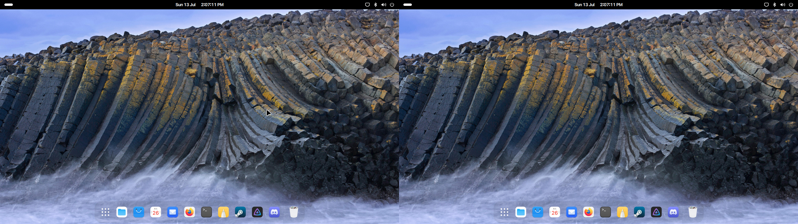

# Multi-monitor panel

## About

As the name of the extension implies, this enables the display of the top panel in GNOME on all monitors, rather than just the primary one.

This is a fork of [lazanet/multi-monitors-add-on](https://github.com/lazanet/multi-monitors-add-on), which is a fork of [spin83/multi-monitors-add-on](https://github.com/spin83/multi-monitors-add-on), which was inspired by [darkxst/multiple-monitor-panels](https://github.com/darkxst/multiple-monitor-panels). Hell of a history.

This particular fork enables functionality for GNOME 47/48, and has some planned additional features on top.

## Installation
### Easy

### Manual

#### Install from releases
1. Go to the [latest release](https://github.com/coolssor/multi-monitor-panel/releases)
2. Download the attached ZIP file
3. Run the following command: 

#### Install from source

1. Run the following commands:
   1. `git clone https://github.com/coolssor/multi-monitor-panel`
   2. `cd multi-monitor-panel`
   3. `cp -r multi-monitor-panel@coolssor ~/.local/share/gnome-shell/extensions/`
2. Restart the shell (log out and back in, or run `killall -HUP gnome-shell`)
3. Enable the extension.

## Planned features
 - Integration with other extensions:
    - [Open Bar](https://github.com/neuromorph/openbar) (theming, floating panel, etc)
    - [Hide Top Bar](https://gitlab.gnome.org/tuxor1337/hidetopbar) (Intellihide)
    - Re-do translation (because I need to learn how to do it properly)

## License

The Multi-monitor panel extension is distributed under the terms of the
GNU General Public License, version 2 or later. See the LICENSE file for details.
